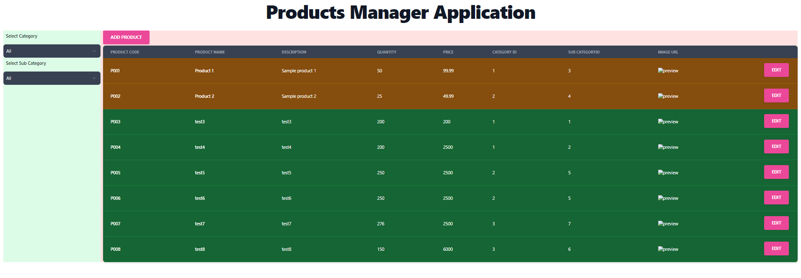
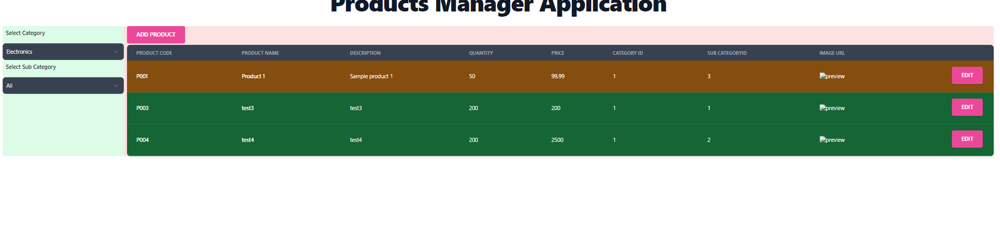
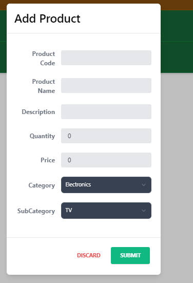
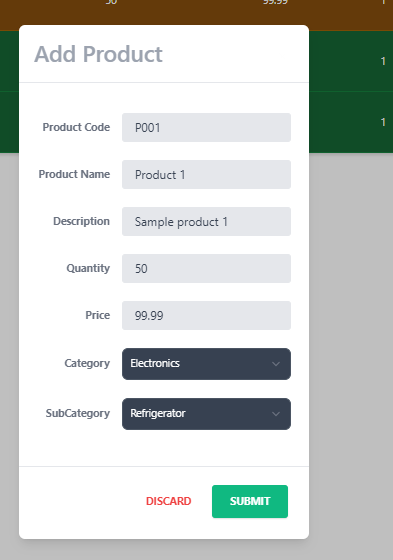

# Product Management System

Product management system help to manage (add, update, view and search) any kinds of products.

1. User can search product based on category and subcategory (Category: Electronics ->Subcategory (TV, Mobile and refrigerator), Apparel-> Subcategory (Men’s Cloth and Women’s cloth) and Footwear-> (Men’s Footwear and kid’s footwears)) – Category and sub-category list can be in memory/pre-defined list.
2. Product listing page should have columns (Product Code, Name, Quantity, Price, Product description and image)
3. User should be able to add and edit products.
4. If product quantity is less than 10, then grid row background should be in red colour and if quantity between 10 to 100 it should be in orange colour and if quantity is more than 100 then it should be in green colour.

Technologies Used:

1. .Net Core Web API
2. ORM (EF Core)
3. Any Database (SQL Server)
4. Client-side tech (React)
5. Tailwind CSS

Project has following folder structure:

├───Backend
│ └───Services
│ ├───ProductAppService
│ │ ├───Aggregates
│ │ ├───Commands
│ │ ├───Controllers
│ │ ├───Dtos
│ │ ├───Filters
│ │ ├───Migrations
│ │ ├───Properties
│ │ ├───Repository
│ │ └───Services
│ └───ProductService.Tests
└───Frontend
└───product-manager  
└───src
├───assets
| └───images
├───components
│ └───products
| │ ├───add
| │ ├───list
| │ └───search
└───models
| │ ├───product
| │ ├───category
| │ └───subcategory

Thsi project has multiple layers

1.  Backend:
    Created the .net core web api using the CQRS pattern.
    Used EF core for the CRUD Operations
    used LINQ for search capabilities as it is sample project.
    Added Exception Handling
    Added console Logger.
    Added sample Testcases using the xunit & N Substitute.

2.  Frontend
    Used React for fornt end development.
    used typescript for type checking.
    Used Tailwind css for styling & forms.

Screenshots:

Filtered Quereies

Add Form

Edit Form

